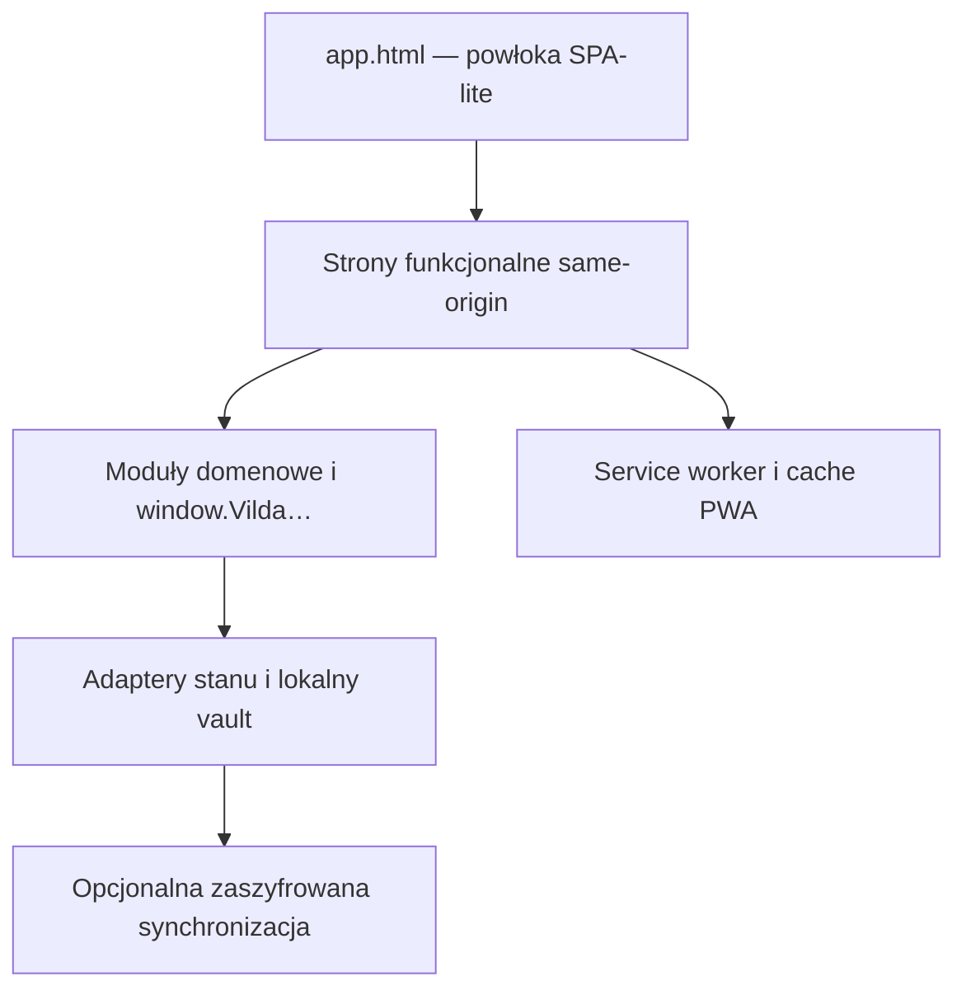

# Architektura Vilda

Stan zweryfikowany dla bazowego commita `audyt` `4c36d8120018087d47cdba3f4aa153eb6c80c83b` z 22 lipca 2026 r. Zmiany obejmujące architekturę powinny aktualizować ten dokument oraz wskazany commit.

## Zakres repozytorium

`vilda-calc` jest publicznym repozytorium statycznej aplikacji wdrożeniowej i narzędzi jakości. Produkcja nie wymaga kompilacji w tym repozytorium: przeglądarka ładuje wersjonowane pliki HTML, CSS, JS, JSON i obrazy bezpośrednio.

Znaczna część JavaScriptu jest zminifikowanym artefaktem. Pełniejszy zestaw czytelnych źródeł, materiałów medycznych i kod usługi synchronizacji jest utrzymywany poza tym publicznym drzewem. Rozdział nie jest jednak kompletny: repozytorium nadal zawiera czytelne moduły, service workera oraz historyczne dokumenty wewnętrzne, m.in. dotyczące synchronizacji, PRO i wdrożeń. Ich przegląd i przeniesienie do przyszłego prywatnego repozytorium źródłowego pozostają długiem migracyjnym.

## Widok całości

Powłoka nie zamienia stron w jeden bundle. Poszczególne strony zachowują własne punkty wejścia i mogą działać samodzielnie, a `app.html` osadza je w ramach wspólnej nawigacji.

## Punkty wejścia

| Plik | Rola |
|---|---|
| `app.html` | Powłoka aplikacji, nawigacja i osadzanie paneli |
| `index.html` | Wzrastanie, antropometria, energia i główne formularze |
| `docpro.html` | Karty profesjonalne, panele kliniczne i monitorowanie terapii |
| `kalkulator-klirens.html` | Równania nerkowe, klirens i wyniki laboratoryjne |
| `homa-ir.html` | Kalkulator HOMA-IR |
| `steroidy.html` | Konwersje steroidów i moduł edukacyjny HPTA |
| `cukrzyca.html` | Moduł diabetologiczny |
| `terminarz.html` | Terminarz, wizyty i przypomnienia |
| `ustawienia.html` | Preferencje aplikacji i operacje użytkownika |

Trasy i osadzanie paneli definiuje przede wszystkim `vilda_shell.js`. Zmiana adresu albo nazwy strony wymaga sprawdzenia odwołań w shellu, nawigacji, service workerze, sitemapach i testach.

## Warstwy

### 1. Powłoka i wspólne komponenty

- `vilda_shell.js` — nawigacja i cykl życia paneli;
- `vilda_chrome.js` i `vilda_chrome.css` — wspólne menu i nagłówek;
- `vilda_init.js`, `vilda_deps.js`, `vilda_app_helpers.js` — inicjalizacja i współdzielone zależności;
- `sidebar.css`, `style.css`, `ios26-v2.css` — warstwa wyglądu.

Skrypty są globalne i zależne od kolejności ładowania. Publiczne obiekty `window.Vilda…` pełnią rolę kontraktów między modułami. Ich zmiana wymaga wyszukania wszystkich konsumentów oraz testu uruchomienia zarówno w shellu, jak i samodzielnie.

### 2. Obliczenia i dane domenowe

Do tej warstwy należą m.in.:

- dane wzrastania i LMS: `centile_data.js`, `ds_lms.js`, `vilda_growth_reference_data.js`;
- predykcje wzrostu: `bayley_pinneau_data.js`, `rwt_data.js`, `reinehr_cdgp_data.js`, `advanced_growth_kowd.js`;
- SGA: `sga_birth_module.js`, `sga_intergrowth_data.js`, `sga_malewski_data.js`;
- laboratorium i jednostki: `lab_clinical_panels.js`, `lab_units_data.js`, `lab_unit_converter.js`;
- terapie: moduły GH/IGF-1, otyłości, antybiotyków, nadciśnienia, bisfosfonianów i grypy;
- żywienie: `nutrition_norms.js`, `nutrition_micros.js`, moduły planu diety i szacowanego spożycia.

Wykaz i status źródeł: `docs/clinical/ALGORITHMS.md`.

### 3. Szacowane spożycie energii

Ten obszar został celowo rozdzielony na warstwy bez zmiany obliczeń, JSON, autosave i synchronizacji:

| Moduł | Odpowiedzialność |
|---|---|
| `vilda_estimated_intake_input_model.js` | Zbudowanie modelu wejściowego i danych do oceny ryzyka |
| `vilda_estimated_intake.js` | Czysty model obliczeniowy i przedziały spożycia |
| `vilda_estimated_intake_ui.js` | Zbudowanie reprezentacji wyniku |
| `vilda_estimated_intake_runtime.js` | Kontrolowane efekty po obliczeniu i stan runtime |
| `vilda_estimated_intake_dom_mount.js` | Montowanie wyniku w istniejącym DOM |
| `app.js` | Orkiestracja wywołania `calcEstimatedIntake()` |

Granice te są częścią kontraktu regresyjnego. Łączenie ich ponownie zwiększa ryzyko niezamierzonej zmiany zapisu lub synchronizacji.

### 4. Stan, zapis i raporty

- `vilda_persistence_adapter.js` i `vilda_persist_runtime.js` rozdzielają typy pamięci i cykl życia stanu;
- `vilda_session_bridge.js` i `vilda_frame_sync.js` koordynują stan między panelami tego samego originu;
- `vilda_data_import_export.js`, `vilda_file_export.js` i moduły raportów odpowiadają za import, eksport i prezentację danych;
- `vilda_save_status_indicator.js`, `vilda_unsaved_guard.js` i `vilda_update_hooks.js` śledzą zmiany i bezpieczne aktualizacje;
- moduły vaulta, kryptografii, uwierzytelnienia i retencji zarządzają chronionym stanem użytkownika.

Nie wolno przenosić pola między pamięcią sesji, pamięcią trwałą i danymi pochodnymi bez analizy cyklu życia, zachowania wielu kart, czyszczenia oraz odtworzenia pacjenta. Samo zachowanie jednego widoku po odświeżeniu nie wystarcza jako test.

### 5. Synchronizacja

Publiczne moduły `vilda_sync.js`, `vilda_sync_integration.js` i `vilda_realtime.js` integrują aplikację z opcjonalną usługą synchronizacji. Szczegóły infrastruktury i kod usługi nie powinny być kopiowane do publicznych zgłoszeń.

Zmiana synchronizacji wymaga sprawdzenia co najmniej:

- pracy offline i ponownego połączenia;
- konfliktów oraz usunięć;
- izolacji kart i urządzeń;
- braku ujawnienia danych jawnych;
- kompatybilności ze starszym klientem;
- eksportu i odtworzenia kopii.

### 6. PWA i cache

`manifest.json` opisuje instalowaną aplikację i ikony. `service-worker-kalorii.js` kontroluje cache, aktualizację oraz obsługę offline.

Wersjonowane adresy zasobów są elementem migracji cache. Przy zmianie zasobu trzeba sprawdzić jego `?v=`, `SW_VERSION`, wszystkie odwołania w precache oraz zachowanie aktualizacji istniejącej instalacji. Usunięcie historycznego adresu może zepsuć aktualizację użytkownikowi, który przechodzi ze starszej wersji.

## Testy i CI

`package.json` nie jest częścią runtime aplikacji. Definiuje narzędzia jakości:

- kontrolę polityki repozytorium;
- ESLint i kontrolę składni;
- Vitest dla wybranych czystych modeli;
- historyczne zestawy regresji PRO;
- Playwright dla stron, układu mobilnego i PWA/offline.

Workflow `.github/workflows/ci.yml` uruchamia się dla PR-ów do `audyt` i commitów na `audyt`. Nie należy zmieniać nazw istniejących jobów bez sprawdzenia ochrony gałęzi.

CodeQL jest osobnym skanem bezpieczeństwa. Jego alert nie potwierdza podatności bez analizy, a brak alertu nie potwierdza bezpieczeństwa ani poprawności klinicznej.

## Inwarianty architektury

1. Strony działają w shellu i jako samodzielne dokumenty.
2. Ramki komunikują się tylko przez jawnie określone kanały same-origin.
3. Moduł kliniczny liczy na własnych danych i nie modyfikuje niepowiązanej karty.
4. Stan UI i wartości pochodne nie są automatycznie danymi pacjenta.
5. Obliczenie, renderowanie, efekty runtime i zapis pozostają rozdzielone tam, gdzie istnieją osobne moduły.
6. Test odwołuje się do kodu produkcyjnego, a nie duplikuje jego implementacji.
7. Zmiana PWA uwzględnia migrację istniejącego cache i scenariusz offline.
8. Przed wdrożeniem publiczny artefakt musi przejść kontrolę kompletności „na czysto”, bez polegania na plikach pozostałych z poprzedniej wersji. Obecny proces nie potwierdza tego jeszcze automatycznie.

## Dług architektoniczny

- proces źródło → artefakt publiczny nie jest jeszcze automatycznie odtwarzalny z tego repozytorium;
- część zminifikowanych plików utrudnia recenzję i analizę CodeQL;
- szczegółowa dokumentacja bezpieczeństwa i biznesu wymaga przeniesienia do prywatnego repozytorium;
- biblioteki i zasoby zewnętrzne wymagają kompletnego rejestru wersji, licencji i not prawnych;
- kompletność czystego artefaktu wdrożeniowego wymaga osobnej kontroli przed automatyzacją publikacji;
- domyślna gałąź GitHuba powinna zostać przełączona ze starego `main` na `audyt` po zachowaniu historycznego `main`.
