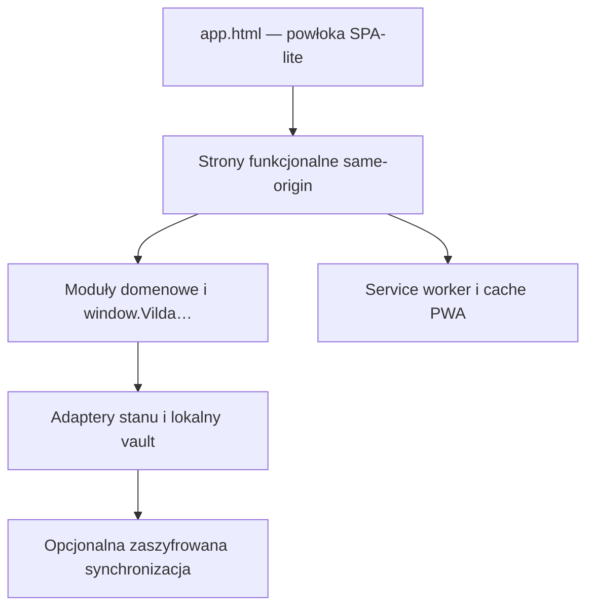

# Architektura Vilda

Stan zweryfikowany dla bazowego commita `audyt` `4c36d8120018087d47cdba3f4aa153eb6c80c83b` z 22 lipca 2026 r. Zmiany obejmujące architekturę powinny aktualizować ten dokument oraz wskazany commit.

## Zakres repozytorium

`vilda-calc` jest publicznym repozytorium statycznej aplikacji wdrożeniowej i narzędzi jakości. Produkcja nie wymaga kompilacji w tym repozytorium: przeglądarka ładuje wersjonowane pliki HTML, CSS, JS, JSON i obrazy bezpośrednio.

Znaczna część JavaScriptu jest zminifikowanym artefaktem. Pełniejszy zestaw czytelnych źródeł, materiałów medycznych i kod usługi synchronizacji jest utrzymywany poza tym publicznym drzewem. Rozdział nie jest jednak kompletny: repozytorium nadal zawiera czytelne moduły, service workera oraz historyczne dokumenty wewnętrzne, m.in. dotyczące synchronizacji, PRO i wdrożeń. Ich przegląd i przeniesienie do przyszłego prywatnego repozytorium źródłowego pozostają długiem migracyjnym.

## Widok całości

```mermaid
flowchart TD
    A["app.html — powłoka SPA-lite"] --> B["Strony funkcjonalne same-origin"]
    B --> C["Moduły domenowe i window.Vilda…"]
    C --> D["Adaptery stanu i lokalny vault"]
    D --> E["Opcjonalna zaszyfrowana synchronizacja"]
    B --> F["Service worker i cache PWA"]
```

Powłoka nie zamienia stron w jeden bundle. Poszczególne strony zachowują własne punkty wejścia i mogą działać samodzielnie, a `app.html` osadza je w ramach wspólnej nawigacji.

## Punkty wejścia

| Plik | Rola |
|---|---|
| `app.html` | Powłoka aplikacji, nawigacja i osadzanie paneli |
| `index.html` | Wzrastanie, antropometria, energia i główne formularze |
| `docpro.html` | Karty profesjonalne, panele kliniczne i monitorowanie terapii |
| `kalkulator-klirens.html` | Równania nerkowe, klirens i wyniki laboratoryjne |
| `homa-ir.html` | Kalkulator HOMA-IR |
| `steroidy.html` | Konwersje steroidów i moduł edukacyjny HPTA |
| `cukrzyca.html` | Moduł diabetologiczny |
| `terminarz.html` | Terminarz, wizyty i przypomnienia |
| `ustawienia.html` | Preferencje aplikacji i operacje użytkownika |

Trasy i osadzanie paneli definiuje przede wszystkim `vilda_shell.js`. Zmiana adresu albo nazwy strony wymaga sprawdzenia odwołań w shellu, nawigacji, service workerze, sitemapach i testach.

## Warstwy

### 1. Powłoka i wspólne komponenty

- `vilda_shell.js` — nawigacja i cykl życia paneli;
- `vilda_chrome.js` i `vilda_chrome.css` — wspólne menu i nagłówek;
- `vilda_init.js`, `vilda_deps.js`, `vilda_app_helpers.js` — inicjalizacja i współdzielone zależności;
- `sidebar.css`, `style.css`, `ios26-v2.css` — warstwa wyglądu.

Skrypty są globalne i zależne od kolejności ładowania. Publiczne obiekty `window.Vilda…` pełnią rolę kontraktów między modułami. Ich zmiana wymaga wyszukania wszystkich konsumentów oraz testu uruchomienia zarówno w shellu, jak i samodzielnie.

### 2. Obliczenia i dane domenowe

Do tej warstwy należą m.in.:

- dane wzrastania i LMS: `centile_data.js`, `ds_lms.js`, `vilda_growth_reference_data.js`;
- predykcje wzrostu: `bayley_pinneau_data.js`, `rwt_data.js`, `reinehr_cdgp_data.js`, `advanced_growth_kowd.js`;
- SGA: `sga_birth_module.js`, `sga_intergrowth_data.js`, `sga_malewski_data.js`;
- laboratorium i jednostki: `lab_clinical_panels.js`, `lab_units_data.js`, `lab_unit_converter.js`;
- terapie: moduły GH/IGF-1, otyłości, antybiotyków, nadciśnienia, bisfosfonianów i grypy;
- żywienie: `nutrition_norms.js`, `nutrition_micros.js`, moduły planu diety i szacowanego spożycia.

Wykaz i status źródeł: `docs/clinical/ALGORITHMS.md`.

### 3. Szacowane spożycie energii

Ten obszar został celowo rozdzielony na warstwy bez zmiany obliczeń, JSON, autosave i synchronizacji:

| Moduł | Odpowiedzialność |
|---|---|
| `vilda_estimated_intake_input_model.js` | Zbudowanie modelu wejściowego i danych do oceny ryzyka |
| `vilda_estimated_intake.js` | Czysty model obliczeniowy i przedziały spożycia |
| `vilda_estimated_intake_ui.js` | Zbudowanie reprezentacji wyniku |
| `vilda_estimated_intake_runtime.js` | Kontrolowane efekty po obliczeniu i stan runtime |
| `vilda_estimated_intake_dom_mount.js` | Montowanie wyniku w istniejącym DOM |
| `app.js` | Orkiestracja wywołania `calcEstimatedIntake()` |

Granice te są częścią kontraktu regresyjnego. Łączenie ich ponownie zwiększa ryzyko niezamierzonej zmiany zapisu lub synchronizacji.

### 4. Stan, zapis i raporty

- `vilda_persistence_adapter.js` i `vilda_persist_runtime.js` rozdzielają typy pamięci i cykl życia stanu;
- `vilda_session_bridge.js` i `vilda_frame_sync.js` koordynują stan między panelami tego samego originu;
- `vilda_data_import_export.js`, `vilda_file_export.js` i moduły raportów odpowiadają za import, eksport i prezentację danych;
- `vilda_save_status_indicator.js`, `vilda_unsaved_guard.js` i `vilda_update_hooks.js` śledzą zmiany i bezpieczne aktualizacje;
- moduły vaulta, kryptografii, uwierzytelnienia i retencji zarządzają chronionym stanem użytkownika.

Nie wolno przenosić pola między pamięcią sesji, pamięcią trwałą i danymi pochodnymi bez analizy cyklu życia, zachowania wielu kart, czyszczenia oraz odtworzenia pacjenta. Samo zachowanie jednego widoku po odświeżeniu nie wystarcza jako test.

### 5. Synchronizacja

Publiczne moduły `vilda_sync.js`, `vilda_sync_integration.js` i `vilda_realtime.js` integrują aplikację z opcjonalną usługą synchronizacji. Szczegóły infrastruktury i kod usługi nie powinny być kopiowane do publicznych zgłoszeń.

Zmiana synchronizacji wymaga sprawdzenia co najmniej:

- pracy offline i ponownego połączenia;
- konfliktów oraz usunięć;
- izolacji kart i urządzeń;
- braku ujawnienia danych jawnych;
- kompatybilności ze starszym klientem;
- eksportu i odtworzenia kopii.

### 6. PWA i cache

`manifest.json` opisuje instalowaną aplikację i ikony. `service-worker-kalorii.js` kontroluje cache, aktualizację oraz obsługę offline.

Wersjonowane adresy zasobów są elementem migracji cache. Przy zmianie zasobu trzeba sprawdzić jego `?v=`, `SW_VERSION`, wszystkie odwołania w precache oraz zachowanie aktualizacji istniejącej instalacji. Usunięcie historycznego adresu może zepsuć aktualizację użytkownikowi, który przechodzi ze starszej wersji.

**Strategia cache (P-SW rata 1, decyzja właściciela 2026-09-24).**

| Żądanie | Strategia |
|---|---|
| Dokument HTML | z pamięci + odświeżenie w tle |
| Zasób bez `?v=` | z pamięci + odświeżenie w tle |
| Zasób z `?v=` (powłoka i runtime) | **niezmienny**: z pamięci bez odświeżania; przy braku — raz z sieci |

Hosting (GitHub Pages) ignoruje `?v=` i oddaje bieżący plik. Dawniej odświeżenie w tle zapisywało więc pod starym kluczem treść nowego wydania, a strona ze starego HTML-a ładowała mieszankę wersji modułów. Przykład z raty H1: nowy silnik diety bez nowego pliku danych, co dawało REE `null` i fałszywy komunikat kliniczny. Teraz stary HTML dostaje stare, spójne klucze, a nowy HTML — nowe. **Każda zmiana treści pliku wymaga podbicia `?v=`**; pilnuje tego `tests/unit/wersje-zasobow.test.mjs` (stan: `tests/fixtures/wersje-zasobow.json`, odświeżanie: `node tests/scripts/wersje-zasobow.mjs --zapisz`).

Czego to nie zamyka:
- klienci z SW ≤ 1.1.65 zachowują stare zachowanie aż do aktywacji nowego SW;
- instalacja pobiera historyczne adresy z bieżącą treścią serwera;
- chybienie na starym kluczu pobiera bieżący plik.

Pełne domknięcie wymagałoby plików z hashem w nazwie albo katalogów per wydanie, co jest osobną decyzją o modelu wdrożenia. Dlatego silnik diety trzyma `henryPrzejsciowo()` co najmniej 3 miesiące po wydaniu SW 1.1.66.

## Testy i CI

`package.json` nie jest częścią runtime aplikacji. Definiuje narzędzia jakości:

- kontrolę polityki repozytorium;
- ESLint i kontrolę składni;
- Vitest dla wybranych czystych modeli;
- historyczne zestawy regresji PRO;
- Playwright dla stron, układu mobilnego i PWA/offline.
- siatkę zrzutów wyglądu (Playwright, `tests/visual`, `npm run test:visual`) i kontrolę dryfu stylów względem design systemu (`npm run design-system -- --strict`).

Workflow `.github/workflows/ci.yml` uruchamia się dla PR-ów do `audyt` i commitów na `audyt`. Nie należy zmieniać nazw istniejących jobów bez sprawdzenia ochrony gałęzi.

Workflow `.github/workflows/wyglad.yml` („Wygląd”, P-STYLE rata 1, decyzja właściciela 2026-09-28) uruchamia się tylko dla PR-ów zmieniających pliki, które mogą zmienić wygląd (arkusze, strony, skrypty powłoki i wyglądu, `design-system/`, testy wizualne). Ma dwa joby: dryf stylów względem `design-system/src` (`--strict`) i porównanie ośmiu stron w dwóch szerokościach i czterech trybach wyglądu z wzorcami PNG w `tests/visual/wzorce`. Wzorce powstają wyłącznie na `ubuntu-latest`: ręczne uruchomienie z opcją „aktualizuj_wzorce” albo usunięcie katalogu wzorców w PR-ze odświeża je i wypycha na gałąź jednym commitem, po czym job sam uruchamia „Kontrola jakości” i „Wygląd” dla tego commita (commit z `GITHUB_TOKEN` nie uruchamia workflow'ów, `workflow_dispatch` jest wyjątkiem). Skutek uboczny filtra ścieżek: zmiana renderowania z pliku spoza filtra (np. `app.js`) wychodzi dopiero przy najbliższym PR-ze ze stylami — wtedy odświeża się wzorce tak samo. Arkusze CSS są od tej raty sformatowane (`npm run css:formatuj`, dowód równoważności `npm run css:cssom`), a strażnik `tests/unit/css-sformatowany.test.mjs` nie dopuszcza powrotu postaci zminifikowanej.

**Tokeny w źródle (P-STYLE rata 2a, decyzja właściciela 2026-09-28).** Wartości kolorów, cieni, `z-index` i `opacity`, które design system nazwał tokenami, są w arkuszach zmiennymi `var(--token)` zadeklarowanymi w `:root` na początku `style.css` (jeden arkusz ładowany na każdej stronie; nazwy jak w `tokens.json`). Zamiana jest równoważna co do pikseli: zmienna dostaje dokładnie wartość literału i nie jest nigdzie nadpisywana; tokeny zmieniające wartość między trybami wyglądu (wielowartościowe w `tokens.json`) są celowo poza mapą, bo podmiana literału zmieniłaby wygląd w trybach kontrastu. Odwołania `var(--x, fallback)` istniejące w bazie do zmiennych, które dopiero teraz powstały, dostały równoważny token albo literał fallbacku, żeby zdefiniowanie zmiennej nic nie zmieniło. Narzędzia: `tests/scripts/tokenizuj-css.mjs` (mapa i reguły w `tests/support/tokeny-css.mjs`), dowód `tests/scripts/porownaj-style-obliczone.mjs` (style obliczone każdej strony w obu rewizjach), strażnik `tests/unit/css-tokeny.test.mjs`. Producent design systemu rozpoznaje partial z literałem jako tę samą regułę co źródło z `var(--x)` i odświeża go do postaci źródła.

**Rata 2b (wymiary).** Odstępy (`--space-*`, tylko w `margin`/`padding`/`gap`), promienie (`--radius-*`, tylko w `border-radius` i formach długich), grubości obramowań (`--border-hairline`/`-emphasis`/`-pro`, atom długości w `border`/`outline` i formach `-width`), rozmycie tła (`--blur-*`, funkcje `blur()`/`saturate()` w `backdrop-filter`) i wymiary układu (`--container-max-width`, `--drawer-width`… tylko w `width`/`height`/`flex-basis`/`grid-template-*`) są zmiennymi w tym samym bloku `:root`. Zasięg własności jest istotą tej raty: `12px` w `padding` to odstęp, w `border-radius` promień, a w `font-size` zostaje literałem. Poza mapą celowo: zero (nie jest odstępem), `--radius` (efektywnie 12px, bo późniejszy blok `:root` nadpisuje wcześniejsze 8px — literał 12px dostaje `--radius-12`), zmienne modułów z dalszych bloków `:root` (`--pulse-ring`, `--metabolic-summary-border-radius`, grubości obramowania podsumowania), osiem tokenów układu nazwanych od komponentu, których wartość dzielą niepowiązane elementy (44px to nie tylko strzałka powłoki), oraz punkty przełamania — `var()` w prelude `@media` jest niedozwolone. Poza obiema ratami zostają style inline stron i 509 kolorów bez żadnego tokenu (`npm run css:tokenizuj -- --kandydaci`).

**Rata 3 (warstwa trybów).** Tryby wyglądu to klasy `body` z `ios26-ui.js`: `glass-level-0…4`, `high-contrast-level-0…3` (0 = wyłączony) i `dark-bg-level-0…2`. Wartości zależne od trybu już przed tą ratą były zmiennymi: `--lg-*` na poziom szkła, `--hc-*` na poziom kontrastu, aliasy modułów (`--edu-*`, `--diet-ui-*`, `--nutrition-ui-*`, `--contact-*`, `--diab-*`) do `--hc-*`; jedyne nadpisania własności bezpośrednio w regule trybu to tło strony w `body.dark-bg-level-N` oraz reguły kontrastu w `style.css` i `vilda_auth_ui.css`, które z `!important` przebijają nadpisania skórki szkła (też `!important`) — to zostaje do raty 4. Rata 3 usuwa potrojenie: reguła wspólna dla trzech poziomów kontrastu powtarzała każdy selektor trzy razy (281 tripletów w `style.css`, `vilda_auth_ui.css`, `edu-video-ui.css`); teraz ma jeden selektor z `:is(.high-contrast-level-1, .high-contrast-level-2, .high-contrast-level-3)` — dopasowanie to suma trzech części, a swoistość `:is()` to maksimum argumentów, czyli swoistość jednej klasy, więc reguła wygrywa i przegrywa z tymi samymi regułami co dotąd (`:is()` było już używane w arkuszach). Bloki zmiennych na poziom zostają osobne. Narzędzia: `tests/support/tryby-css.mjs`, `tests/scripts/zwin-tryby-css.mjs`, strażnik `tests/unit/css-tryby.test.mjs`; producent design systemu rozwija zwiniętą postać do trzech części przy dopasowaniu partiali i rozwiązywaniu kaskady tokenów, a jego tokenizacja selektorów nie dzieli już `:is(a, b)` po spacjach. Dowód stylów obliczonych obejmuje wszystkie dziesięć trybów (`--tryby wszystkie`).

**Rata 4 (szkło jako baza).** Skórka `.liquid-ios26` jest zawsze włączona (`ios26-ui.js` dodaje klasę na `body`), a jej 208 reguł (957 deklaracji, 580 z `!important`) nadpisuje reguły bazowe. Kolejność bezpiecznych kroków: (4a) usunięcie martwych deklaracji bazowych, (4b) złożenie nadpisań do reguł bazowych z analizą kaskady per komponent, dopiero potem zdjęcie `!important` z warstwy kontrastu.

*Rata 4a (wykonana).* Deklaracja bazowa własności P jest martwa, gdy istnieje reguła nadpisująca, która po zdjęciu prefiksu skórki (`.liquid-ios26` z pierwszego złożenia; gołe `body` też znika, bo każdy element strony jest w `body`) dopasowuje co najmniej te same elementy (jej lista selektorów zawiera każdą część selektora bazowego w postaci kanonicznej), stoi w tym samym kontekście `@media`/`@supports`, deklaruje P z `!important` i jest na każdej stronie, na której jest reguła bazowa — czyli pochodzi z tego samego arkusza albo z arkusza globalnego (`ios26-v2.css`, `style.css`, `sidebar.css`, `vilda_chrome.css` są na wszystkich stronach; macierz stron × arkuszy czytana z `<link>` w HTML). Wtedy dla każdego elementu dopasowanego przez regułę bazową pasuje też nadpisanie, a nadpisanie zawsze wygrywa (ważne przeciw nieważnemu; przy dwóch ważnych — wyższa swoistość o klasę skórki; kolejność ładowania nie ma znaczenia), więc usunięcie martwej deklaracji nie zmienia żadnego zwycięzcy kaskady. Warunki są celowo zachowawcze: nadpisanie za kombinatorem dziecka (`body.liquid-ios26 > .x`), w innym kontekście `@media`, z arkusza nieglobalnego innego niż bazowy albo pokrywające tylko część listy selektorów bazowych nie liczy się. Premisa „skórka na każdej stronie” wymagała jednej poprawki: `subskrypcja.html` jako jedyna strona nie ładowała `ios26-ui.js` (ładowała arkusz skórki, ale `body` nigdy nie dostawało klasy), więc reguły bazowe były tam żywe — dowód stylów obliczonych to wykrył (przycisk synchronizacji w pasku); decyzją właściciela (2026-09-28) strona ładuje teraz `ios26-ui.js` jak wszystkie inne i ma skórkę oraz tryby wyglądu. Usunięte: 266 deklaracji (48 całych reguł) — `style.css` 197, `vilda_auth_ui.css` 39, `vilda_chrome.css` 29, `ios26-v2.css` 1. Narzędzia: `tests/support/szklo-css.mjs` (parser z pozycjami, analiza jedno- i wieloarkuszowa, usuwanie), `node tests/scripts/usun-martwe-css.mjs` (`-- --sprawdz`, `-- --raport`; `-- --partiale` czyści partiale design systemu z reguł już nieistniejących i z deklaracji martwych pod skórką z arkuszy globalnych, resztę odświeża `--update`), strażnik `tests/unit/css-szklo.test.mjs`. Dowód stylów obliczonych w dziesięciu trybach.

### Równoległość zestawu przeglądarkowego (decyzja właściciela 2026-09-11)

Zestaw e2e szedł jednym wątkiem i urósł do 19 minut na CI, aż przestał się mieścić w limicie joba. Teraz **workery biorą po całym pliku**: `workers` w `playwright.config.mjs` to 4 na CI (tyle rdzeni ma runner `ubuntu-latest`), lokalnie decyduje Playwright. Zmienna `PLAYWRIGHT_WORKERS` nadpisuje jedno i drugie — do porównań A/B bez edytowania konfiguracji.

**Testy w jednym pliku zostają po kolei** (`fullyParallel: false`). To nie jest ostrożność na wyrost, tylko wynik pomiaru: audyt wszystkich 51 plików nie znalazł ani jednego, który trzymałby stan między swoimi testami, ale próba puszczenia testów z jednego pliku równolegle wywracała się na **czasie** — pliki, w których pojedynczy test trwa kilkadziesiąt sekund, przekraczały budżet, gdy cztery ich testy dzieliły te same rdzenie. Zysk był przy tym niewielki (lokalnie 24,3 min wobec 26,8 min), bo na czterech rdzeniach wiąże łączna praca, a nie układ plików.

**Warunek, który trzeba utrzymać.** Żaden plik e2e nie może trzymać mutowalnego stanu na poziomie modułu ani używać `beforeAll`/`afterAll`. Dziś nie musi — testy w pliku idą po kolei — ale to jedyna rzecz, która dzieli nas od włączenia równoległości także wewnątrz plików, a stan między testami wprowadza się niechcący i cicho. Pilnuje tego `tests/unit/e2e-rownoleglosc.test.mjs`.

**Co zostaje do rozważenia (odłożone decyzją właściciela 2026-09-11).** Zmierzony zysk na CI to 19 min 25 s → 14,5 min. Nie więcej, bo przez ostatnie 3 min 20 s biegu pracuje JEDEN worker, a trzy stoją: `ustawienia-panel-techniczny` przemiela swoje osiem testów po kolei, po ok. 32 s każdy. Żeby zejść niżej, trzeba rozbić ten ogon. Dwie drogi:

1. **Równoległość wewnątrz wybranych plików** — tylko dla tych, które nie są kruche czasowo. Wymaga wcześniejszego utwardzenia kilku testów; każdy taki wyścig wychodzi dopiero pod obciążeniem, tak jak pięć opisanych niżej.
2. **Potanienie najdroższych testów** — w `ustawienia-panel-techniczny` każdy z ośmiu testów od nowa zakłada konto sejfu i ładuje całą stronę. Te ~32 s idą głównie na przygotowanie, nie na sprawdzanie. Droga trudniejsza, ale daje więcej i nie wprowadza nowej klasy wyścigów.

**Kształt CI (decyzja właściciela 2026-09-11, po włączeniu reguły „Require branches to be up to date before merging").** Dwa przebiegi po każdym PR-ze — jeden na PR-ze, drugi po „Squash and merge" na `audyt` — dawały ok. 30 minut czekania. Po włączeniu reguły „up to date" drzewo po squashu jest **tym samym drzewem**, które przeszło testy na PR-ze, więc drugi przebieg e2e niczego nie dokładał. Teraz: na `push` do `audyt` idą tylko lint i testy jednostkowe (minuta; gałąź zachowuje własną historię zielone/czerwone), a e2e idą wyłącznie na PR-ze i przy ręcznym uruchomieniu (`workflow_dispatch`). Na PR-ze zestaw dzieli się na **trzy odłamki** (`--shard=k/3`) na trzech runnerach naraz, każdy z czterema workerami; job „Testy przeglądarkowe i PWA" zbiera ich wyniki i to on jest wymaganym statusem w regułach gałęzi. Odłamki nie czekają na job jednostkowy. **Co się traci:** regresję e2e wprowadzoną przez sam merge (przy regule „up to date" — tylko przez wyścig dwóch merge'ów w tej samej minucie) zobaczy dopiero następny PR, nie gałąź. Uznane za akceptowalne przy jednym autorze.

**Ogon po podziale na odłamki (pomiar 2026-09-11, PR #251).** Trzy odłamki zamknęły się w 2 min 18 s / 3 min 21 s / 4 min 47 s samych testów — Playwright dzieli po liczbie testów, nie po czasie, i najdroższy plik trafił do trzeciego. Dolna granica przy tym podziale to ok. 5 min na PR; więcej odłamków nie pomoże, dopóki jeden plik trwa ponad 4 minuty. Obie drogi powyżej pozostają aktualne; odłożone decyzją właściciela.

**Czego równoległość nie wybacza.** Każde „kliknij i od razu sprawdź" oraz każde odmierzone `waitForTimeout` staje się wyścigiem, gdy maszyna jest obciążona. Pięć takich miejsc wyszło dopiero po zrównolegleniu i wszystkie były **latentne od dawna** — jeden wątek na nieobciążonej maszynie po prostu nigdy nie przegrywał. Asercja ma czekać na **warunek**, a nie na upływ czasu; jeżeli wartość zapisuje się przez adapter ALBO awaryjnie do `localStorage`, test ma czytać ją tak, jak czyta ją moduł, a nie zaglądać do jednego magazynu.

CodeQL jest osobnym skanem bezpieczeństwa. Jego alert nie potwierdza podatności bez analizy, a brak alertu nie potwierdza bezpieczeństwa ani poprawności klinicznej.

## Inwarianty architektury

1. Strony działają w shellu i jako samodzielne dokumenty.
2. Ramki komunikują się tylko przez jawnie określone kanały same-origin.
3. Moduł kliniczny liczy na własnych danych i nie modyfikuje niepowiązanej karty.
4. Stan UI i wartości pochodne nie są automatycznie danymi pacjenta.
5. Obliczenie, renderowanie, efekty runtime i zapis pozostają rozdzielone tam, gdzie istnieją osobne moduły.
6. Test odwołuje się do kodu produkcyjnego, a nie duplikuje jego implementacji.
7. Zmiana PWA uwzględnia migrację istniejącego cache i scenariusz offline.
8. Przed wdrożeniem publiczny artefakt musi przejść kontrolę kompletności „na czysto”, bez polegania na plikach pozostałych z poprzedniej wersji. Obecny proces nie potwierdza tego jeszcze automatycznie.
9. Źródło danych pacjenta, które odświeża swoją pamięć asynchronicznie, ogłasza zmianę wspólnym sygnałem `vilda:zrodlo-pacjenta-zmienione` (`vilda_zrodla_pacjenta.js`). Ciche odświeżenie pamięci to wyścig z przypadkowym przemalowaniem strony, a przegrany wyścig zostawia na ekranie wynik z niewłaściwej siatki aż do przeładowania.

## Kierunek: wielopopulacyjność (decyzja właściciela 2026-09-09)

Aplikacja ma w przyszłości działać międzynarodowo. Docelowo użytkownik będzie mógł wybrać
populację odniesienia (a być może i pochodzenie etniczne), więc **każdy zestaw norm musi być
danymi, nie założeniem wbudowanym w silnik**.

Reguła projektowa dla wszystkich nowych modułów referencyjnych:

1. **Dane oddzielone od silnika.** Normy mieszkają w osobnym pliku danych (wzorzec, który
   aplikacja już stosuje: `sga_intergrowth_data.js`, `sga_malewski_data.js`,
   `bayley_pinneau_data.js`), a silnik jest bezpaństwowy i przyjmuje źródło jako argument.
2. **Rejestr źródeł zamiast wartości domyślnej wbudowanej w kod.** Silnik wystawia listę
   dostępnych źródeł z metadanymi: populacja, kraj, lata zbierania danych, zakres wieku,
   dopuszczalny odstęp pomiarów, metoda (LMS / centyle / wzór), cytowanie z DOI.
3. **Populacja odniesienia jest częścią wyniku, nie przypisem.** Każdy wynik niesie nazwę
   źródła, żeby dało się je pokazać lekarzowi i zapisać w rekordzie — tak jak siatki
   wzrostowe niosą już `source` (`PALCZEWSKA` / `OLAF` / `WHO`).
4. **Brak polskich norm nie jest wymówką do milczenia, ale musi być nazwany.** Dla tempa
   wzrastania polskich norm nie ma (sprawdzone: monografia Palczewskiej jest przekrojowa);
   używamy najbliższej populacji i mówimy o tym wprost.

Ta reguła obowiązuje wstecz przy każdej modyfikacji istniejących modułów referencyjnych i
z góry przy każdym nowym. Wybór populacji w interfejsie jest osobnym, późniejszym etapem —
architektura ma być na niego gotowa, zanim powstanie.

## Dług architektoniczny

- proces źródło → artefakt publiczny nie jest jeszcze automatycznie odtwarzalny z tego repozytorium;
- część zminifikowanych plików utrudnia recenzję i analizę CodeQL;
- szczegółowa dokumentacja bezpieczeństwa i biznesu wymaga przeniesienia do prywatnego repozytorium;
- biblioteki i zasoby zewnętrzne wymagają kompletnego rejestru wersji, licencji i not prawnych;
- kompletność czystego artefaktu wdrożeniowego wymaga osobnej kontroli przed automatyzacją publikacji;
- domyślna gałąź GitHuba powinna zostać przełączona ze starego `main` na `audyt` po zachowaniu historycznego `main`.
