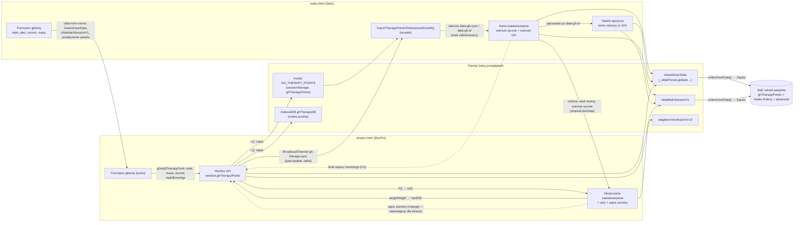

# Audyt przepływu pomiarów: „Zaawansowane obliczenia wzrostowe” ↔ „Leczenie hormonem wzrostu — Monitorowanie leczenia” (2026-09-29)

**Zlecenie właściciela:** „zrób audyt przepływu informacji (pomiarów) pomiędzy kartą Zaawansowane obliczenia wzrostowe na str. głównej a kartą leczenie hormonem wzrostu (sekcja monitorowanie leczenia) na stronie docpro. […] zobacz czy dane gdzieś nie uciekają, czy nie są dublowane, będzie to wstęp do nowej funkcji”. Nowa funkcja: wpisane w karcie zaawansowanej pomiary mają dać się „zaciągnąć” do monitorowania leczenia GH (edycja kilku punktów terapii naraz) albo zamienić w punkt terapii bezpośrednio z karty zaawansowanej. Wybór wariantu należy do właściciela.

**Stan kodu:** `audyt` `0f1e0a7`, SW 1.1.109; `vilda_advanced_growth.js?v=72`, `gh_therapy_monitor.js?v=45`, `gh_igf_therapy.js?v=27`, `app.js?v=229`, `vilda_data_import_export.js?v=89`, `vilda_persist_runtime.js?v=17`.

**Metoda.** Artefakty są zminifikowane, więc funkcje nazywam nazwą publiczną (`window.…`), a wewnętrzne — nazwą z artefaktu, np. `ue()` w `gh_therapy_monitor.js`. Kod czytano w kopiach sformatowanych Prettierem (poza repozytorium). Obok tego były dwa niezależne przeglądy warstw zapisu i modelu karty zaawansowanej oraz sześć scenariuszy w prawdziwym Chromium (Playwright, powłoka `app.html` i strony samodzielne, konto sejfu i pacjenci fikcyjni). Każdy scenariusz robił zrzut `sessionStorage`, `localStorage`, IndexedDB, DOM obu ramek i rekordu w sejfie po każdym kroku. Stan szukano po wartościach-znacznikach, np. 139,9 cm. **Żaden plik produkcyjny nie został zmieniony.** Przy każdym ustaleniu zaznaczam, czy potwierdził je pomiar (**[pomiar]**), czy tylko lektura kodu (**[kod]**).

**Poufność.** Część ustaleń dotyczy poufności i integralności danych pacjenta. Zgodnie z `SECURITY.md` przekazano je właścicielowi osobnym, poufnym aneksem i nie opisuję ich tutaj. W tym dokumencie odsyłam do nich jako do „aneksu poufnego”, bez szczegółów.

**Werdykt w skrócie.**

- Przepływ działa w **jedną stronę**: punkt terapii GH → wiersz w karcie zaawansowanej.
- W drugą stronę **nie ma żadnego przepływu dostępnego dla lekarza**. Pomiarów wpisanych w karcie zaawansowanej monitor GH nie widzi, a poprawka wiersza punktu GH na stronie głównej rozjeżdża się z punktem po cichu (U1).
- Jedyny kod zapisu zwrotnego (wiersz → punkt) działa w **niewidocznej** kopii karty zaawansowanej na DocPro (U3).
- Ten sam pomiar żyje w kilkunastu kopiach i jest zapisywany w rekordzie **dwukrotnie** (U2). Deduplikację robi co najmniej siedem miejsc, każde według własnej reguły (§3).
- Nowa funkcja jest wykonalna. Wymaga jednak najpierw jednego wspólnego API punktów terapii i zamknięcia U1. Inaczej doda kolejną kopię logiki i kolejne źródło rozjazdu (§5).

---

## 1. Uczestnicy

| Element | Strona | Plik | Rola w przepływie |
|---|---|---|---|
| Karta „Zaawansowane obliczenia wzrostowe” | `index.html` (Start) | `vilda_advanced_growth.js`, `app.js` (`collectAdvancedMeasurements`) | Wiersze historii `#advMeasurements .measure-row`: `.adv-age-years`, `.adv-age-months`, `.adv-height`, `.adv-weight`, `.adv-bone-age`. **Nie mają daty.** `advancedGrowthData.measurements` to wyłącznie historia; bieżący pomiar pochodzi z formularza głównego (`#age`, `#ageMonths`, `#height`, `#weight`, `#sex`). |
| Kopia karty zaawansowanej | `docpro.html` | ten sam moduł | `#advancedGrowthSection` leży w ukrytych kontenerach (`#results`, `.container`: `display:none`), a przycisk ma `disabled`. **[pomiar]** Lekarz jej nie widzi, ale ona działa: liczy `advancedGrowthData` (z niej monitor bierze MPH do mpSDS) i dostaje wiersze punktów GH (U3). |
| Monitor leczenia GH | tylko `docpro.html` | `gh_therapy_monitor.js` | Lista punktów terapii `window.ghTherapyPoints`, tabela, hSDS / tempo / hSDS−mpSDS, segmenty wg preparatu. Punkty powstają przyciskami Włączenie / Kontynuacja / Zakończenie (`ghAddTherapyPoint`) z bieżącego formularza albo formularzem „Wsteczny punkt” (`ghAddRetroPoint`). |
| Karta GH/IGF-1 | tylko `docpro.html` | `gh_igf_therapy.js` | Program, preparat, dawka (`#therProg`, `#therDrug`, `#therDailyDose`); czyta **ostatni element** listy punktów (kolejność wstawiania, nie wiek). |
| Tabela „Szacowane spożycie energii” | `index.html` | `vilda_advanced_growth.js` (parowanie), `vilda_estimated_intake*.js` | Lustro wierszy karty zaawansowanej, **w tym wierszy punktów GH** (`data-gh-id`), plus zablokowany wiersz bieżącego pomiaru. |
| Karta pacjenta, sejf | obie | `vilda_auth_ui.js`, `vilda_vault.js`, `vilda_growth_prediction_validation*.js` | Czytają rekord i **scalają** źródła historii, każde według własnej reguły (§3). |

### 1.1. Punkt terapii GH (schemat faktyczny)

```text
{ id: String(Date.now()+Math.random()), type: "start"|"continue"|"end",
  ageYears: <pełne lata>, ageMonths: <0–11, część miesięczna>,
  weight: kg, height: cm, boneAge: lata|null,
  dose: mg/kg/d  (Ngenla: mg/kg/tydz), doseUnit: "mg/kg/d"|"mg/kg/tydz",
  doseAbs: mg/d (dla preparatu tygodniowego też mg/d, czyli tydzień/7),
  drug, program, igf1: ng/mL|null, igf1Unit: "ng/mL", igf1DaysSinceDose }
```

Reguły monitora:
- najwyżej jedno „Włączenie” i jedno „Zakończenie”;
- wiek > 0, a masa, wzrost i dawka muszą być dodatnie;
- program i preparat są wymagane.

Tabela sortuje najpierw według rodzaju wizyty, potem według wieku, więc „Kontynuacja” sprzed „Włączenia” pokazuje się za nim.

**Dwie ścieżki tworzenia punktu przyjmują dawkę w różnych jednostkach [kod]:**
- przyciski główne (`He()`) biorą **mg/kg/d** z karty GH;
- „Wsteczny punkt” bierze **mg/d** (dla Ngenli mg/tydzień) i dzieli ją przez masę.

Walidacja jest napisana dwa razy.

---

## 2. Mapa przepływów



### 2.1. Start → DocPro (pomiar bieżący, rodzice, wiek kostny, historia)

- **Pomiar bieżący** (wiek, płeć, wzrost, masa, nazwisko) trafia do formularza DocPro czterema kanałami:
  - `sharedUserData` (lustra najwyższego poziomu i `_vildaPersist.byId`);
  - `vildaMainSessionV1`;
  - `vilda-form-mirror` (BroadcastChannel plus chwilowy wpis w `localStorage`, `custom-fixes.js`);
  - odtworzenie stanu przy przełączeniu panelu w powłoce.

  **[pomiar]** DocPro miał po wejściu `14 l. 0 m., 148,5 cm, 50,5 kg, F`, tak jak Start.
- **Rodzice i wiek kostny** (`advMotherHeight`, `advFatherHeight`, `advBoneAge`) idą przez `sharedUserData` do ukrytej karty DocPro. Ta liczy `advancedGrowthData.targetHeight`, a monitor bierze z niego mpSDS. Kolejność źródeł mpSDS w `ae()`:
  1. `targetHeight`;
  2. `targetStats.sd`;
  3. pola `#advMotherHeight` / `#advFatherHeight`;
  4. `readSharedPersist()`.
- **Wiersze ręczne historii** też docierają do ukrytej karty DocPro. **[pomiar]** DocPro miał 11 l. 0 m. / 123,9 i 12 l. 6 m. / 131,3. **Monitor ich jednak nie czyta:** nie ma żadnej ścieżki, która zamieniłaby wiersz ręczny w punkt terapii. Lekarz musi przepisać każdy pomiar w „Wsteczny punkt”, po jednym. To jest luka, którą ma zamknąć nowa funkcja.
- **Nowy punkt z bieżącej wizyty** (`ghAddTherapyPoint`) bierze `#age`, `#ageMonths`, `#weight`, `#height` z formularza DocPro (lustra Start) oraz **bieżący wiek kostny z karty zaawansowanej** (`#advBoneAge`). **[pomiar]** Punkt 14 l. 0 m. dostał wiek kostny 12,5.

### 2.2. DocPro → Start (punkty terapii → wiersze karty)

1. Zapis punktu w monitorze (`L()`) robi kolejno:
   - zapis modułu `GH_THERAPY_POINTS`;
   - zdarzenie `vilda:therapy-points-changed`;
   - zapis w IndexedDB `ghTherapyDB`;
   - komunikat `gh-therapy-sync` `{type:"update", tabId}`.

   Komunikat niesie tylko sygnał, bez danych.
2. `app.js` na Start odbiera komunikat. Filtr wymaga tego samego `tabId`, czyli tej samej karty przeglądarki. Wtedy woła `importTherapyPointsToAdvancedGrowth()`. Mostek uruchamia się też:
   - po kliknięciu nagłówka karty;
   - w `ghReimport()` po wczytaniu pacjenta, „Odtwórz zapis” i „Nowy pomiar”;
   - przy odtworzeniu stanu.

   Na DocPro mostek jest wyłączony: `be()` zwraca `false` dla `docpro.html`.
3. Mostek dokłada wiersze oznaczone `data-gh-sync="true"` i `data-gh-id`, blokuje w nich wiek (podpowiedź „edytuj w module Monitorowanie…”) i paruje je z tabelą spożycia. Na koniec liczy kartę i wysyła `input` w `#advName`, co budzi autozapis.

   **[pomiar]** Po dodaniu na DocPro punktów 12 l. 6 m. (Włączenie, identyczne z wierszem ręcznym), 13 l. 1 m., 13 l. 7 m. i 14 l. 0 m. (bieżąca wizyta) Start pokazał:
   - wiersze ręczne 11 l. 0 m. i 12 l. 6 m.;
   - wiersze GH 13 l. 1 m. i 13 l. 7 m.

   Punkt 12 l. 6 m. schował się pod wierszem ręcznym, a 14 l. 0 m. pod pomiarem bieżącym.
4. Na DocPro tę samą robotę w ukrytej karcie wykonuje `ue()`, wołane z każdego `F()` (odświeżenia tabeli). Robi to **według innych reguł** (§3).

### 2.3. Start → DocPro (poprawki wierszy GH)

**Takiego przepływu nie ma.** Zapis zwrotny (nasłuch `change` na `.adv-height` / `.adv-weight` / `.adv-bone-age` w wierszu z `data-gh-id`) rejestruje `gh_therapy_monitor.js`, a ten plik ładuje się wyłącznie na DocPro. Nasłuch działa więc tylko w dokumencie DocPro, na karcie, której nikt nie widzi. Skutek opisuje U1.

### 2.4. Zapis rekordu (`collectUserData()` → sejf)

| Pole rekordu | Co zawiera | Wiersze punktów GH |
|---|---|---|
| `advanced.data.measurements` | historia z karty zaawansowanej | **odsiane** (`ghSync === true`); przy odczycie odsiewa je po raz drugi `be()` |
| `ghTherapyPoints` | pełna lista punktów | źródło prawdy |
| `intake.history` | lustro tabeli spożycia | **obecne, bez znacznika**, plus pomiar bieżący **[pomiar]** |
| `growthBasic.data.measurements` | lustro karty podstawowej | wg `tests/unit/growth-history-gh-merge.test.mjs` obecne (tu niemierzone, karta podstawowa nieużywana) |

Zapis z DocPro dał ten sam rekord co zapis ze Start **[pomiar]**. DocPro buduje historię i spożycie ze wspólnego stanu, a nie z własnego DOM.

---

## 3. Gdzie żyje jeden pomiar i kto go deduplikuje

**Kopie punktu 13 l. 1 m. / 139,9 cm znalezione jednocześnie w jednej karcie przeglądarki [pomiar]:**

1. `window.ghTherapyPoints` na Start;
2. `window.ghTherapyPoints` na DocPro;
3. `sessionStorage.ghTherapyPoints` (moduł);
4. `sharedUserData` (`globals.ghTherapyPoints`, `globals.advancedGrowthData` z wierszami GH, `globals.intakeRowsUI` z `ghId`);
5. `vildaMainSessionV1`;
6. `wagaiwzrost:docproUi:v2` (wiersze ukrytej karty DocPro);
7. `vilda-save-ref-v1`;
8. IndexedDB `ghTherapyDB`;
9. rekord w sejfie (`ghTherapyPoints` + `intake.history`);
10. cztery kopie w DOM: wiersz karty zaawansowanej Start, wiersz tabeli spożycia Start, wiersz ukrytej karty DocPro i wiersz tabeli monitora.

**Reguły „to ten sam pomiar”:**

| Miejsce | Klucz | Tolerancja | Kto wygrywa |
|---|---|---|---|
| Mostek na Start (`fn()`): punkt a pomiar bieżący | miesiąc łącznie | wzrost i masa ±0,11 | pomiar bieżący (punkt bez wiersza) |
| Mostek na Start (`ghReczny`): punkt a wiersz ręczny | miesiąc łącznie | wzrost ±0,11, masa ±0,11 (gdy obie są) | wiersz ręczny (wiersz GH usuwany) |
| Mostek na Start: przejęcie nieoznaczonego wiersza GH | miesiąc łącznie | ±0,05 | wiersz dostaje `data-gh-id` |
| DocPro `ue()`: punkt a wiersz | **sam miesiąc** | — | pierwszy wiersz w danym miesiącu (punkt bez wiersza) |
| Parowanie z tabelą spożycia | `data-gh-id`, potem wartości, potem kolejność | ±0,05 | — |
| Sejf `_extractSnapshotMeasurements` (Karta pacjenta) | scalenie `advanced` + `growthBasic` + `ghTherapyPoints` | identyczne wartości | pierwsze źródło (metadane) |
| Sejf, anty-nadpisanie wierszy | **sam miesiąc** (`ageMonths`) | — | — |
| Walidacja prognoz `computeForPayload` | miesiąc | — | wiersz ręczny wygrywa z punktem GH |
| Oś czasu Karty pacjenta | `ghPointId` / `linkedAgeMonths` | — | zdarzenie z punktu (`_ghFromPoint`) |

**Skutki:**
- Ta sama lista punktów może dać inny zestaw wierszy na Start i na DocPro. Przykład: punkt w tym samym miesiącu co wiersz ręczny, ale 1,5 cm wyżej. Na Start to osobny wiersz, bo to inny pomiar. W ukrytej karcie DocPro wiersza nie będzie, bo miesiąc jest zajęty.
- Dwa pomiary z jednego miesiąca zlewają się w kilku miejscach.
- Wiek zapisywany jest trojako:
  - punkt GH: `ageYears` całkowite + `ageMonths` 0–11;
  - wiersz karty: `ageYears` dziesiętne + `ageMonths` łącznie;
  - wiek kostny: `boneAge` w punkcie, `boneAgeYears` w wierszu, `boneAgeMonths` dla bieżącego.
- **Żaden z tych obiektów nie ma daty pomiaru.**

---

## 4. Ustalenia

**U1 — poprawka wiersza punktu GH w karcie zaawansowanej (Start) rozjeżdża się z punktem po cichu. [pomiar] Istotne.**

W wierszu GH zablokowany jest tylko wiek; wzrost, masa i wiek kostny dają się edytować. Zmiana nie wraca do punktu (brak zapisu zwrotnego na Start, §2.3), ale **zostaje w części kopii**.

*Zmierzone 1 — punkt 13 l. 1 m., wzrost 139,9 → 140,4 na Start, potem „Zapisz”:*
- karta zaawansowana liczy z 140,4;
- tabela spożycia pokazuje 140,4 z oznaczeniem GH;
- rekord ma `intake.history` = 140,4, ale `ghTherapyPoints` = 139,9;
- monitor DocPro i Karta pacjenta pokazują 139,9.

*Zmierzone 2 — punkt 13 l. 7 m., wzrost 144,7 → 145,9, potem ponowny import (to samo robią klik w nagłówek, F5 i wczytanie):*
- karta zaawansowana wraca do 144,7, więc poprawka lekarza **znika**;
- tabela spożycia **zostaje przy 145,9** z oznaczeniem GH.

Szacowanie spożycia, karta zaawansowana, monitor i rekord mają więc różne wartości tego samego pomiaru, a lekarz nie dostaje żadnego sygnału. Przed nową funkcją trzeba wybrać jedno:
- zablokować te pola jak wiek (z odesłaniem do monitora);
- albo zrobić prawdziwy zapis zwrotny w jednym, wspólnym miejscu (§5).

**U2 — punkt GH jest zapisany w rekordzie dwa razy. [pomiar]**
- Raz w `ghTherapyPoints`, drugi raz w `intake.history`, **bez znacznika**. Według testów jednostkowych trzeci raz w `growthBasic`.
- Zasada z GROWTH-HV-UI6 („zapis nie przechowuje wierszy z terapii”) obowiązuje tylko w `advanced.data.measurements`.
- Konsumenci rekordu zakładają, że kopie są identyczne i deduplikują po wartościach. Po U1 identyczne nie są.

**U3 — niewidoczna karta zaawansowana na DocPro żyje własnym życiem. [pomiar]**
- Dostaje wiersze punktów GH (`ue()`) i liczy `advancedGrowthData`, razem z wierszami GH.
- Zapisuje się do `wagaiwzrost:docproUi:v2` i `sharedUserData`.
- Tylko ona ma nasłuch zapisu zwrotnego. **[pomiar]** Zmiana masy w ukrytym wierszu z 45,1 na 47,1 zmieniła punkt terapii.
- `F()` kończy się wcześniej, gdy lista punktów jest pusta, i nie woła `ue()`. **[pomiar]** Po usunięciu **ostatniego** punktu jego wiersz (144,7) zostaje w ukrytej karcie DocPro i w `advancedGrowthData` DocPro aż do przeładowania.
- Do rekordu to nie przechodzi (`ghSync` jest odsiewane). Moduły DocPro czytające `window.advancedGrowthData` (m.in. `inline_docpro_05.js`, podsumowania, epikryza, lista B.64) mogą jednak do tego czasu widzieć usunięty pomiar **[kod]**.

**U4 — Start i DocPro stosują różne reguły „ten sam pomiar”** (§3, `fn()` kontra `ue()`). **[kod]**

**U5 — zapis zwrotny zmienia dawkę bezwzględną, nie dawkę na kilogram. [pomiar, na ukrytej karcie DocPro]**
- Po zmianie masy 45,1 → 47,1 kg dawka `dose` (mg/kg/d) została bez zmian, a `doseAbs` wzrosła z 1,50 do 1,57 mg/d.
- Punkt wsteczny wpisuje się natomiast w **mg/d**. Poprawka masy zmienia więc po cichu dawkę, którą lekarz faktycznie wpisał.
- Dla edycji wielu punktów naraz to rozstrzygnięcie kliniczne: co jest wartością pierwotną, mg/d czy mg/kg (§6).

**U6 — dwie ścieżki tworzenia punktu z różnymi jednostkami dawki i zdublowaną walidacją** (§1.1). **[kod]**

**U7 — punkt z bieżącej wizyty bierze wiek kostny z pola „bieżącego” karty zaawansowanej** (`#advBoneAge`), a punkt wsteczny — z własnego pola. Wiersze historii mają wiek kostny osobno, per wiersz. **[pomiar]** Konwersja wiersza w punkt musi przenieść wiek kostny **wiersza**, nie bieżący.

**U8 — martwy komunikat.** `clearAllData` wysyła `gh-therapy-sync` `{type:"clear"}` **bez** `tabId`, więc jedyny odbiorca w `app.js` go odrzuca. Dziś to nieszkodliwe, bo czyszczenie idzie innymi drogami. **[kod]**

**U9 — testy nie obejmują prawdziwej ścieżki.** E2E wstrzykują punkty przez `writeModuleJSON('GH_THERAPY_POINTS')` i `window.ghTherapyPoints` na Start. Żaden test:
- nie dodaje punktu prawdziwym monitorem na DocPro i nie sprawdza, co dociera na Start;
- nie odwołuje się do `ghTherapyDB` ani `gh-therapy-sync`;
- nie sprawdza zapisu zwrotnego ani U1. **[kod]**

**Czy dane „uciekają”:**
- W badanych ścieżkach aplikacja nie wysyła pomiarów ani punktów GH poza urządzenie inaczej niż zaszyfrowanym rekordem sejfu, bo synchronizacja przenosi zaszyfrowane migawki.
- `gh-therapy-sync` niesie tylko sygnał.
- Wartości nie trafiają do konsoli.
- Kanał `vilda-form-mirror` przenosi wartości formularza (nazwisko, wiek, płeć, wzrost, masa) między ramkami tego samego originu.
- Ustalenia o przechowywaniu kopii poza sejfem i o izolacji pacjentów są w aneksie poufnym.

**Hipotezy niepotwierdzone pomiarem:**
- Usunięty punkt GH wraca z `vildaMainSessionV1` po F5. Kod scala puste pola sesji na DocPro, ale w zmierzonym przebiegu po usunięciu i F5 lista została pusta.
- Wiersz-duch z U3 trafia do rekordu. Nie trafia, bo `ghSync` jest odsiewane.

**Drobne, poza przepływem:** przycisk `#advClearBtn` („Wyczyść dane tej karty”) jest usuwany z DOM przy starcie, a `clearAdvancedGrowthCard()` nic nie robi. Karty zaawansowanej nie da się wyczyścić osobno.

---

## 5. Wnioski dla nowej funkcji

1. **Jedno źródło prawdy: lista punktów GH** (moduł `GH_THERAPY_POINTS` i pole rekordu `ghTherapyPoints`). Wiersze GH w karcie zaawansowanej i w tabeli spożycia są jej projekcją. Nowa funkcja nie może dokładać trzeciej ścieżki pisania punktów obok `He()` i `ghAddRetroPoint`.
2. **Najpierw wspólne API punktów**, ładowane na obu stronach (np. `window.VildaGhPoints`). Powinno obejmować:
   - normalizację wieku;
   - walidację (jedno Włączenie / Zakończenie, dodatnie wartości, program i preparat);
   - jednostki dawki i `doseAbs`;
   - nadawanie i **zachowanie** `id`;
   - zapis wraz z sygnałami, czyli moduł, `window.ghTherapyPoints`, `vilda:therapy-points-changed` i `gh-therapy-sync` z `tabId`.

   Dziś ta logika istnieje tylko w `gh_therapy_monitor.js`, który na Start się nie ładuje, i to w dwóch wariantach. Przeniesienie jej do czytelnego modułu z testami wymaga czytelnego źródła (AGENTS.md §2).
3. **Wariant „zrób punkt z wiersza karty zaawansowanej”** jest prostszy architektonicznie: pomiar jest już w jednym wierszu. Na Start potrzeba tylko wspólnego API i uzupełnienia danych terapii. Program, preparat, dawka, rodzaj wizyty i IGF-1 nie istnieją w karcie zaawansowanej; domyślne wartości można wziąć z ostatniego punktu.

   **Wariant „zaciągnij do monitora i edytuj wiele punktów”** wymaga formularza wielowierszowego na DocPro i czytania wierszy ręcznych, które DocPro zna tylko ze wspólnego stanu (ukryta karta, U3).
4. **Co z wierszem ręcznym po konwersji** (decyzja):
   - (a) wiersz ręczny znika, a punkt przejmuje jego wartości i wiek kostny wiersza (U7). Brak dubla w `advanced.data.measurements`, a wiersz wraca jako wiersz GH;
   - (b) wiersz zostaje i jest trwale powiązany z punktem. To wymaga nowego pola w rekordzie, czyli zmiany JSON zapisu — osobna decyzja (AGENTS.md §5).

   Bez powiązania dzisiejsze `ghReczny` pokaże wiersz ręczny, schowa wiersz GH, a obie kopie zaczną się rozjeżdżać jak w U1. **Rekomendacja: (a).**
5. **Zamknąć U1 przed edycją wielu punktów.** Edycja wielu punktów to właśnie zapis zwrotny. Powinien iść przez wspólne API, a pola wierszy GH na Start powinny być albo zablokowane, albo pisać przez to API. Martwy zapis zwrotny ukrytej karty DocPro (U3) trzeba wtedy usunąć albo przenieść, żeby nie było dwóch.
6. **Tożsamość i daty.** Punkty i wiersze nie mają daty, więc identyfikacja idzie po miesiącu wieku (§3). Edycja zbiorcza musi aktualizować punkty **w miejscu, po `id`**: notatki do wizyt (`ghPointId`) i lustra w tabeli spożycia (`data-gh-id`) odwołują się do identyfikatora. Warto rozważyć datę pomiaru (osobna decyzja, zmiana JSON).
7. **Nie dokładać kopii.** Nowa ścieżka nie powinna pisać do IndexedDB `ghTherapyDB`, zanim właściciel nie rozstrzygnie aneksu poufnego.
8. **Testy do dopisania razem z funkcją:**
   - e2e w powłoce: prawdziwy monitor na DocPro ↔ karta zaawansowana na Start, oba kierunki;
   - strażnik U1;
   - test jednostkowy wspólnego API, wołający funkcję produkcyjną;
   - przypadek „punkt w tym samym miesiącu co wiersz ręczny, ale inny pomiar”;
   - przypadek „usunięcie ostatniego punktu”.

---

## 6. Co pozostaje decyzją właściciela

- Wariant funkcji (§5 p. 3) oraz los wiersza ręcznego po konwersji: (a) albo (b) (§5 p. 4).
- **Kliniczne:** która dawka jest wartością pierwotną przy poprawce masy, mg/d czy mg/kg (U5). Czy punkt z historii może mieć wiek kostny inny niż bieżący (U7, dziś tak).
- Kolejność napraw przed funkcją: U1 (blokada pól albo zapis zwrotny), U3 (ukryta karta DocPro), U2 (czy `intake.history` ma nieść wiersze GH).
- Ewentualna data pomiaru i powiązanie wiersz ↔ punkt w rekordzie (zmiana JSON).
- Aneks poufny.

Ten audyt niczego nie zmienia w wynikach, jednostkach, progach, zapisie ani synchronizacji.

---

## Załącznik A. Scenariusze pomiarowe

Chromium 141 (Playwright), serwer `tests/support/static-server.mjs`, `serviceWorkers: 'block'`. Nowe konto sejfu (hasło testowe, 10 000 iteracji), dane fikcyjne („Audytowa Ewa”). Punkty GH dodawane **prawdziwym** monitorem: karta GH otwierana przyciskiem, a punkty tworzone przez `ghOpenRetroForm`/`ghAddRetroPoint` i `ghAddTherapyPoint`. Po każdym kroku zrzut obu ramek i magazynów oraz szukanie wartości-znaczników.

| Scenariusz | Kroki | Wynik |
|---|---|---|
| A — powłoka, oba kierunki | Start: 14 l. 0 m., 148,5 cm / 50,5 kg, F; rodzice 160/172; wiek kostny 12,5; wiersze ręczne 11 l. 0 m. 123,9/35,7 i 12 l. 6 m. 131,3/40,3 → DocPro: Włączenie wsteczne 12 l. 6 m. 131,3/40,3 (1,3 mg/d), Kontynuacje 13 l. 1 m. 139,9/45,1 i 13 l. 7 m. 144,7/47,2, Kontynuacja bieżąca (0,033 mg/kg/d) → Start → edycja 139,9 → 140,4 → Zapisz → DocPro → Zapisz | §2.1, §2.2, §2.4, §3, U1, U2 |
| C — widoczność i edycje | jak A, dwa punkty; zmiana masy w ukrytym wierszu DocPro; edycja 144,7 → 145,9 na Start i ponowny import; usunięcie punktów | U1, U3, U5 |
| D — usunięcie ostatniego punktu | dwa punkty, przejście Start ↔ DocPro, usunięcie obu „Usuń” + potwierdzenie, Zapisz z DocPro | U3 (wiersz-duch, rekord czysty) |
| E — sesja główna po usunięciu | punkt, usunięcie, przejście na Start, F5 | hipoteza wskrzeszenia niepotwierdzona |
| B1, B2/B3 | cykl życia kopii w IndexedDB; tryb aplikacji zainstalowanej na iOS | aneks poufny |
