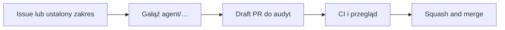

# Jak prowadzimy projekt na GitHubie

Ten dokument opisuje prosty, powtarzalny proces dla właściciela projektu. Kod aplikacji nie zmienia się przez samo utworzenie Issue lub pull requestu.

## Jednorazowe ustawienie repozytorium

Aktywny projekt znajduje się na `audyt`, ale GitHub nadal wskazuje historyczne `main` jako gałąź domyślną. Po zachowaniu `main` jako jednoznacznej gałęzi lub referencji archiwalnej należy ustawić `audyt` jako default branch.

Ta zmiana jest konieczna, aby:

- `README.md` i `SECURITY.md` były widoczne jako główne dokumenty;
- formularze Issues i szablon PR pojawiały się automatycznie;
- Dependabot działał na aktualnym kodzie;
- tygodniowy harmonogram CodeQL uruchamiał się z właściwej gałęzi.

Po zmianie default branch trzeba potwierdzić ochronę `audyt`:

- każda zmiana przez pull request;
- brak wymaganej akceptacji innej osoby, jeżeli właściciel pracuje sam;
- wymagane dotychczasowe kontrole:
  - `Lint, składnia i testy jednostkowe`;
  - `Testy przeglądarkowe i PWA`;
- blokada force push i usunięcia gałęzi;
- pusta lista zwykłych obejść albo świadome ograniczenie administratora.

CodeQL należy najpierw uruchomić i przejrzeć jako baseline. Nie ustawiaj go od razu jako wymaganego testu, dopóki zastane alerty nie zostaną sklasyfikowane.

## Zwykła zmiana

1. Opisz problem lub zakres.
2. Zmiana powstaje na osobnej gałęzi `agent/...`.
3. Otwierany jest draft PR do `audyt`.
4. GitHub uruchamia testy; czerwony wynik wymaga diagnozy.
5. Przy zmianie klinicznej właściciel sprawdza źródło i przypadki regresyjne.
6. Po akceptacji PR przechodzi przez `Squash and merge`.
7. Sprawdź wynik GitHub Pages. W obecnej konfiguracji commit na `audyt` może uruchomić deployment, dlatego scalenie należy traktować jako potencjalną publikację. Docelowo produkcja powinna wymagać osobnego, ręcznego zatwierdzenia.

## Jak czytać wynik PR

| Stan | Znaczenie | Działanie |
|---|---|---|
| Żółty / oczekuje | Test nadal trwa | Poczekaj na zakończenie |
| Zielony | Sprawdzone kontrakty przeszły | Przejrzyj zakres i wpływ kliniczny |
| Czerwony | Test albo skan wykrył problem | Nie scalaj; przeanalizuj log i przyczynę |
| Pominięty | Warunek workflow nie został spełniony | Sprawdź, czy test rzeczywiście nie dotyczy |

Zielone CI nie zatwierdza medycznie wzoru. Potwierdza jedynie to, co test został zaprojektowany sprawdzić.

## Dependabot

Dependabot raz w tygodniu sprawdzi npm i używane GitHub Actions. Aktualizacje minor/patch zostaną zgrupowane, a major pozostaną osobnymi PR-ami.

Każdy PR Dependabota:

1. pozostaje bez automatycznego scalania;
2. przechodzi pełne CI;
3. przy wersji major wymaga przeczytania informacji o niezgodnościach;
4. może zostać zamknięty lub odłożony, jeżeli zmiana jest ryzykowna.

W ustawieniach GitHuba należy osobno włączyć Dependency graph, Dependabot alerts i Dependabot security updates.

## CodeQL

CodeQL analizuje JavaScript przy PR-ach i commitach do `audyt` oraz tygodniowo po ustawieniu `audyt` jako gałęzi domyślnej. Pierwszy skan tworzy punkt odniesienia. Alerty trzeba sklasyfikować jako:

- rzeczywista podatność;
- bezpieczny wzorzec wymagający wyjaśnienia;
- kod historyczny lub zewnętrzny;
- fałszywy alarm.

Nie wyciszaj alertu bez krótkiego uzasadnienia. Po uporządkowaniu baseline można rozważyć dodanie CodeQL do wymaganych kontroli.

## Wydania i wdrożenia

Kolejny etap profesjonalizacji powinien wprowadzić:

- numerowane wydania i tagi;
- automatyczne release notes na podstawie PR-ów;
- kompletność budowanego artefaktu sprawdzaną „na czysto”;
- środowisko testowe;
- ręczne zatwierdzenie produkcji;
- udokumentowany rollback.

Nie należy automatyzować publikacji, dopóki źródło → build → publiczny artefakt nie jest w pełni odtwarzalne i nie obejmuje wszystkich zasobów używanych przez aplikację.
