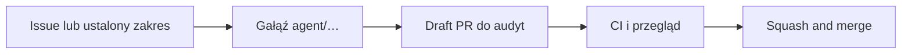

# Jak prowadzimy projekt na GitHubie

Ten dokument opisuje prosty, powtarzalny proces dla właściciela projektu. Kod aplikacji nie zmienia się przez samo utworzenie Issue lub pull requestu.

## Jednorazowe ustawienie repozytorium

Aktywny projekt znajduje się na `audyt`, ale GitHub nadal wskazuje historyczne `main` jako gałąź domyślną. Po zachowaniu `main` jako jednoznacznej gałęzi lub referencji archiwalnej należy ustawić `audyt` jako default branch.

Ta zmiana jest konieczna, aby:

- `README.md` i `SECURITY.md` były widoczne jako główne dokumenty;
- formularze Issues i szablon PR pojawiały się automatycznie;
- Dependabot działał na aktualnym kodzie;
- tygodniowy harmonogram CodeQL uruchamiał się z właściwej gałęzi.

Po zmianie default branch trzeba potwierdzić ochronę `audyt`. Realizuje ją **zestaw reguł** (ruleset) w Settings → Rules → Rulesets, a nie klasyczna ochrona gałęzi w Settings → Branches — to dwa różne mechanizmy i mylenie ich kosztowało cykl przy operacji z 2026-09-10:

- cel: gałąź `audyt` (Target branches → Include by pattern);
- `Require a pull request before merging`, wymagane akceptacje: 0 (właściciel pracuje sam);
- `Require status checks to pass`, dokładnie dwie kontrole:
  - `Lint, składnia i testy jednostkowe`;
  - `Testy przeglądarkowe i PWA`;
- `Block force pushes` i `Restrict deletions`;
- pusta lista obejść (Bypass list) albo świadome ograniczenie administratora;
- Enforcement status: `Active`.

Nazwy wymaganych kontroli muszą **dokładnie** odpowiadać nazwom jobów w `ci.yml`. Literówka nie daje żadnego komunikatu — po prostu żaden pull request nigdy nie stanie się scalalny.

**Jak zdjąć ochronę na czas operacji wymagającej force push.** Na stronie samego zestawu reguł przestaw `Enforcement status` na `Disabled`, wykonaj operację, wróć do `Active`. Adres, który GitHub podaje w komunikacie błędu (`/rules?ref=…`), prowadzi do listy **tylko do odczytu** — nie ma tam żadnego przełącznika, więc łatwo stamtąd omyłkowo skasować cały zestaw zamiast go wyłączyć.

CodeQL należy najpierw uruchomić i przejrzeć jako baseline. Nie ustawiaj go od razu jako wymaganego testu, dopóki zastane alerty nie zostaną sklasyfikowane.

## Zwykła zmiana


```mermaid
flowchart LR
    A["Issue lub ustalony zakres"] --> B["Gałąź agent/…"]
    B --> C["Draft PR do audyt"]
    C --> D["CI i przegląd"]
    D --> E["Squash and merge"]
```

1. Opisz problem lub zakres.
2. Zmiana powstaje na osobnej gałęzi `agent/...`.
3. Otwierany jest draft PR do `audyt`.
4. GitHub uruchamia testy; czerwony wynik wymaga diagnozy.
5. Przy zmianie klinicznej właściciel sprawdza źródło i przypadki regresyjne.
6. Po akceptacji PR przechodzi przez `Squash and merge`.
7. Sprawdź wynik GitHub Pages. W obecnej konfiguracji commit na `audyt` może uruchomić deployment, dlatego scalenie należy traktować jako potencjalną publikację. Docelowo produkcja powinna wymagać osobnego, ręcznego zatwierdzenia.

## Jak czytać wynik PR

| Stan | Znaczenie | Działanie |
|---|---|---|
| Żółty / oczekuje | Test nadal trwa | Poczekaj na zakończenie |
| Zielony | Sprawdzone kontrakty przeszły | Przejrzyj zakres i wpływ kliniczny |
| Czerwony | Test albo skan wykrył problem | Nie scalaj; przeanalizuj log i przyczynę |
| Pominięty | Warunek workflow nie został spełniony | Sprawdź, czy test rzeczywiście nie dotyczy |

Zielone CI nie zatwierdza medycznie wzoru. Potwierdza jedynie to, co test został zaprojektowany sprawdzić.

## Kilka wątków naraz

Kilka wątków (sesji agentów) może pracować równolegle. Ich PR-y wchodzą jednak do `audyt` **po kolei**, bo prawie każdy zmienia te same linie:

- `SW_VERSION` w `service-worker-kalorii.js`;
- `?v=` zmienionych plików na stronach, w skryptach wstrzykujących (`vilda_chrome.js`, `vilda_session_bridge.js`…) i w `EXPECTED_BROWSER_SCRIPTS` (`vilda_smoke_tests.js`);
- wpisy precache w tablicach service workera;
- pin SW w `tests/unit/klirens-ui-model.test.mjs`;
- `tests/fixtures/wersje-zasobow.json`.

Dwa wątki biorą ten sam „następny numer”. Po scaleniu pierwszego PR drugi jest nieaktualny, nawet jeżeli GitHub nie pokazuje konfliktu.

### Zasady dla właściciela

1. **Jeden obszar — jeden wątek.** Równolegle idą prace w różnych modułach. Dwie raty tego samego tematu (np. P-DIETA w `vilda_diet_recommendations.js`) prowadź po kolei.
2. **Scalaj jeden PR naraz.** Po każdym scaleniu pozostałe otwarte PR-y trzeba zaktualizować — także te bez konfliktu.
3. **Wersje na końcu.** Wątek nadaje numery skryptem `npm run podbij-wersje` jako ostatni krok, po scaleniu najnowszego `audyt`.

Wątek, który obserwuje swój PR, dostaje powiadomienie o konflikcie i aktualizuje się sam. W pozostałych przypadkach wklej mu:

> `audyt` się zmienił. Scal `origin/audyt` do swojej gałęzi (`git merge`, bez rebase), rozwiąż konflikty według `docs/GITHUB_WORKFLOW.md` → „Kilka wątków naraz”, uruchom `npm run podbij-wersje` i `npm test`, zatwierdź (commit) i wypchnij.

### Procedura wątku po zmianie `audyt`

```bash
git fetch origin audyt
git merge origin/audyt          # na cudzej gałęzi: bez rebase i force-push
# konflikty — tabela niżej; rozwiązane pliki: git add
npm run podbij-wersje           # przelicza wersje względem origin/audyt i zapisuje
npm test                        # plus reszta walidacji z AGENTS.md § 7
git add -A
git commit                      # kończy też scalanie, jeżeli było w toku
git push
```

Bez `git add` i `git commit` poprawki skryptu zostają tylko na dysku, a PR na GitHubie dalej ma zderzone numery. CI przejdzie wtedy na zielono, bo wypchnięte drzewo jest wewnętrznie spójne. Testy przeglądarkowe po scaleniu uruchamia CI (wymagany status „Testy przeglądarkowe i PWA”).

| Konflikt w | Jak rozwiązać |
|---|---|
| `service-worker-kalorii.js`, linia `SW_VERSION` | dowolna strona |
| `service-worker-kalorii.js`, tablice precache | **suma obu stron** — zachowaj wpisy z `audyt` i z wątku. Wpisów bazy nie usuwaj. Zbędne wpisy wątku dla plików znanych z bazy skrypt usunie, brakujące dopisze; wpisy nowych plików i nowych stron wątku zostają tylko wtedy, gdy je zachowasz |
| strony HTML i skrypty, tokeny `?v=` | dowolna strona w liniach samych wersji; inne zmiany w tym samym fragmencie zachowaj z obu stron |
| `vilda_smoke_tests.js`, `EXPECTED_BROWSER_SCRIPTS` | dowolna strona |
| `tests/unit/klirens-ui-model.test.mjs`, pin `SW_VERSION` | dowolna strona |
| `tests/fixtures/wersje-zasobow.json` | dowolna strona — skrypt przepisze cały plik |
| `docs/clinical/ALGORITHMS.md` | zachowaj oba wpisy |

Numery z konfliktu nie mają znaczenia, bo skrypt liczy je od nowa. **Nie** rozwiązuj konfliktu w stanie wersji samym `node tests/scripts/wersje-zasobow.mjs --zapisz`. Utrwala on kolizję opisaną niżej.

### Dlaczego także bez konfliktu

To już się zdarzyło: #470 (`10b2985`, 2026-09-29) dopisał wpis precache, ale wyszedł pod `SW_VERSION` 1.1.102, który dziewięć minut wcześniej wydał #468 (`6f04ce3`). Oba wątki wpisały ten sam numer, więc git scalił to bez konfliktu. Skrypt dałby 1.1.103.

Symulacja na kodzie z 2026-09-30 (`audyt` `567597c`, otwarte #503 i #504):

- **#503 i #504 scalają się bez żadnego konfliktu**, a mimo to wynik jest zły. #504 podbija SW do 1.1.130, a #503 zmienia cztery pliki, ale SW nie podbija. Po obu scaleniach zmiany #503 wyszłyby pod wersją 1.1.130 z #504. `npm run podbij-wersje` na stanie po scaleniu daje 1.1.131.
- **Dwa wątki zmieniają ten sam plik** (`vilda_diet_recommendations.js`, oba podbijają do `?v=67`). Strony, precache i `SW_VERSION` scalają się bez konfliktu, bo obie strony wpisały to samo. Konflikt jest tylko w `wersje-zasobow.json`. Połączona treść obu zmian zostałaby pod `?v=67`, który klient z zainstalowaną aplikacją ma już w pamięci z treścią pierwszego wątku. Service worker nie odświeża wpisów z `?v=` (P-SW rata 1), więc druga zmiana nigdy by do niego nie dotarła. Skrypt nadaje `?v=68` i SW 1.1.132, a strażnicy wersji przechodzą.

### Co robi `npm run podbij-wersje`

Liczy wersje wyłącznie z bazy (`origin/audyt`) i z treści plików w drzewie roboczym:

- plik o treści innej niż w bazie dostaje `?v=` o jeden większe niż najwyższe `?v=` tego pliku w bazie — na stronach i w tablicach SW, bo klucz z precache bazy klient może już mieć w pamięci; plik niezmieniony dostaje wersję z bazy (tokeny innych plików liczą się przy porównaniu jak w bazie);
- wersję przepisuje na wszystkich stronach, w skryptach i w liście smoke; skrypt, który wstrzykuje plik z nowym `?v=`, zmienia przez to treść i też dostaje nowe `?v=`;
- dopisuje wpis precache zaraz po poprzedniej wersji pliku (także po ostatnim elemencie tablicy); zbędne wpisy dodane na tej gałęzi usuwa, także wpisy plików, których strony już nie ładują; ręcznie dopisany brakujący wpis bieżącej wersji zostawia (P-SW-LAB-PIN); wpisów z bazy nie rusza;
- `SW_VERSION` ustawia na wersję z bazy + 1, gdy zmienił się którykolwiek zasób z pamięci service workera (strona, plik z tablic albo sam SW), inaczej zostawia wersję z bazy;
- aktualizuje pin SW w `tests/unit/klirens-ui-model.test.mjs` i przepisuje `tests/fixtures/wersje-zasobow.json`.

Wynik nie zależy od numerów wpisanych wcześniej, a drugie uruchomienie niczego nie zmienia. Pliki ignorowane przez git (np. makiety `makieta_klirens_*.html`) nie są liczone.

Skrypt przerywa liczenie, gdy scalanie ma nierozwiązane pliki, gdy w plikach, które przepisuje albo porównuje z bazą, zostały znaczniki konfliktu, i w kopii z `core.autocrlf=true`. Odmawia zapisu, gdy gałąź nie zawiera bazy, gdy lokalne `origin/audyt` jest starsze niż na serwerze (`git ls-remote`) albo gdy zniknął wpis precache obecny w bazie.

Poza zakresem skryptu (wypisuje je jako „Do decyzji”):

- nowy plik — trzeba mu nadać `?v=` i dopisać go do `CORE_SHELL_URLS` albo `OPTIONAL_ASSETS`;
- nowa strona — trzeba ją dopisać do `OPTIONAL_DOCUMENTS` albo uzasadnić pominięcie;
- wersje nieliczbowe (`edu-video-ui.css?v=20261003v4`) — ostrzega, gdy treść się zmieniła, a token nie;
- piny wersji plików w testach — wypisuje każdy token podbitego pliku od wersji z bazy wzwyż z numerem linii.

Opcje: `-- --sprawdz` (tylko raport; kod 1, gdy coś trzeba zmienić, jest błąd albo baza jest nieaktualna lub spoza historii gałęzi), `-- --baza=<ref>`, `-- --bez-sieci`. Na końcu raportu jest gotowa linia „Wersje: …; SW x → y” do opisu PR. Logika: `tests/support/podbij-wersje.mjs`; test: `tests/unit/podbij-wersje.test.mjs`.

### Otwarte decyzje właściciela

- **`npm run podbij-wersje -- --sprawdz` w CI.** Wykryłby cichą kolizję na etapie PR, zanim zmiana trafi na `audyt`. Wymaga checkoutu z historią `audyt` (dziś CI pobiera jedną rewizję) i dopisania kontroli do wymaganych statusów.
- **SW podbijany przy wydaniu, a nie w każdym PR.** Usunąłby ostatnią linię wspólną dla wszystkich PR-ów. Dziś jednak każdy commit na `audyt` może trafić na GitHub Pages, więc to zmiana modelu wdrożenia.
- **Merge queue na GitHubie.** Sama nie rozwiązuje konfliktów w tych samych liniach — PR z konfliktem wypada z kolejki. Dopiero razem z kontrolą w CI dawałaby automatyczne „po kolei”.

## Dependabot

Dependabot raz w tygodniu sprawdzi npm i używane GitHub Actions. Aktualizacje minor/patch zostaną zgrupowane, a major pozostaną osobnymi PR-ami.

Każdy PR Dependabota:

1. pozostaje bez automatycznego scalania;
2. przechodzi pełne CI;
3. przy wersji major wymaga przeczytania informacji o niezgodnościach;
4. może zostać zamknięty lub odłożony, jeżeli zmiana jest ryzykowna.

W ustawieniach GitHuba należy osobno włączyć Dependency graph, Dependabot alerts i Dependabot security updates.

## CodeQL

CodeQL analizuje JavaScript przy PR-ach i commitach do `audyt` oraz tygodniowo po ustawieniu `audyt` jako gałęzi domyślnej. Pierwszy skan tworzy punkt odniesienia. Alerty trzeba sklasyfikować jako:

- rzeczywista podatność;
- bezpieczny wzorzec wymagający wyjaśnienia;
- kod historyczny lub zewnętrzny;
- fałszywy alarm.

Nie wyciszaj alertu bez krótkiego uzasadnienia. Po uporządkowaniu baseline można rozważyć dodanie CodeQL do wymaganych kontroli.

## Wydania i wdrożenia

Kolejny etap profesjonalizacji powinien wprowadzić:

- numerowane wydania i tagi;
- automatyczne release notes na podstawie PR-ów;
- kompletność budowanego artefaktu sprawdzaną „na czysto”;
- środowisko testowe;
- ręczne zatwierdzenie produkcji;
- udokumentowany rollback.

Nie należy automatyzować publikacji, dopóki źródło → build → publiczny artefakt nie jest w pełni odtwarzalne i nie obejmuje wszystkich zasobów używanych przez aplikację.
