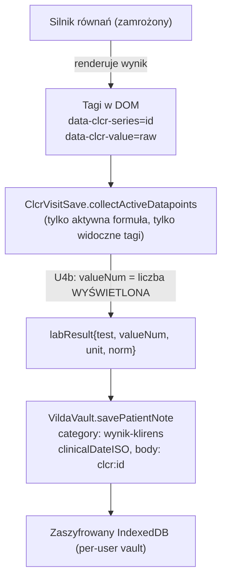

# Model wizyt kalkulatora klirensu

Dokument opisuje „model wizyt" kalkulatora nerkowego (`kalkulator-klirens.html`): jak wynik obliczenia staje się datowaną pozycją karty pacjenta, jak jedzie na istniejących mechanizmach vaultu (eksport/import, synchronizacja, wspólna oś czasu) oraz jakie są zasady utrzymania. Stanowi uzupełnienie [`ARCHITECTURE.md`](ARCHITECTURE.md) i [`DATA_PROTECTION.md`](DATA_PROTECTION.md).

Zakres zmian modelu wizyt był **wyłącznie prezentacyjno-integracyjny**: silnik równań i matematyka pozostają zamrożone. Wszystkie liczby pochodzą z niezmienionego silnika; warstwa wizyt jedynie je taguje, zbiera i zapisuje.

## Cel

Kalkulator liczy pojedynczy wynik dla wybranej formuły. Model wizyt dokłada do tego trwałość kliniczną: wynik wybranej formuły można zapisać jako **datowaną wizytę** przypisaną do pacjenta, a kolejne wizyty układają się w historię (sparkline, trend) i wchodzą do wspólnej karty pacjenta — tak samo jak wyniki z innych narzędzi aplikacji.

Kluczowa zasada: **zapisuje się tylko formuła aktywnie wybrana** przez lekarza. Panele porównawcze (np. eGFR pokazywany obok CKiD U25) są otagowane i widoczne, ale nie trafiają do karty.

## Architektura zapisu

Zapis wizyty to standardowa **notatka pacjenta** (`patientNote`) z kategorią `wynik-klirens`. Klirens jest jedynym modułem korzystającym z datowanych notatek jako „arkusza przepływu" (parametr × wizyta); pozostałe kalkulatory zapisują tablice punktów w payloadzie snapshotu (np. `ghTherapyPoints`).

Etapy:

1. **Tagi silnika.** Silnik renderuje każdy wynik z atrybutami `data-clcr-series="<id formuły>"` oraz `data-clcr-value="<wartość surowa>"`. Dzięki temu warstwa zapisu nie liczy niczego sama — czyta to, co silnik już pokazał.
2. **Zbiórka.** `ClcrVisitSave.collectActiveDatapoints` zbiera datapoints tylko dla **aktywnej** formuły i tylko z **widocznych** tagów. To gwarantuje, że panel porównawczy nie zanieczyści karty.
3. **U4b — spójność zaokrągleń.** `valueNum` zapisany do karty jest nadpisywany liczbą **wyświetloną** (token liczbowy z treści tagu najbliższy wartości surowej, tolerancja `max(1, |raw|·0,02)`), a nie surową wartością zmiennoprzecinkową. Dzięki temu historia i karta pokazują dokładnie tę samą liczbę co nagłówek kalkulatora (np. `80`, nie `79,77`).
4. **Zapis.** `VildaVault.savePatientNote` tworzy notatkę: `category: "wynik-klirens"`, `clinicalDateISO` (data wizyty), `labResult{test, valueNum, unit, norm}` oraz `body` zawierający znacznik `clcr:<id>` (routing/diagnostyka). Wrażliwe pola są szyfrowane; w cleartext pozostają tylko dane routingu.

### Katalog formuł

Źródłem prawdy jest `window.FORMULAS` (składane w `inline_kalkulator_klirens_02.js`). Katalog liczy ~48 formuł pogrupowanych w rodziny; każda zapisuje się tym samym mechanizmem. Reprezentatywne pozycje i nazwy zapisywanych parametrów:

| Rodzina | Przykładowa formuła (`id`) | `labResult.test` | Jednostka |
|---|---|---|---|
| eGFR — dorośli | `egfr` | eGFR — dorośli (kreatynina) | mL/min/1,73 m² |
| eGFR — dzieci/młodzież | `ckid_u25` | eGFR — dzieci i młodzież 1–25 lat (kreatynina) | mL/min/1,73 m² |
| Cockcroft–Gault | `cg` | Klirens kreatyniny — dorośli (ml/min) | mL/min |
| Spot ratio | `ACR` | Albumina/kreatynina — ACR | mg/g |
| Frakcja wydalania | `FENa_spot` | Frakcja wydalania sodu (FENa) | % |
| Dobowa zbiórka (DZM) | `cl24` | Klirens kreatyniny — zmierzony (DZM) | mL/min |
| Dializa | `KTV` | URR — wskaźnik redukcji mocznika **oraz** spKt/V (mocznik, pojedyncza pula) | % / — |

Moduł dializy (`KTV`) jest **dwuwynikowy** — jedna wizyta zapisuje dwie pozycje karty (URR i spKt/V).

Formuły z potwierdzeniami boolowskimi (protokół zbiórki DZM, zgodność próbek spot, warunki sesji dializy) wymagają w UI odpowiedzi przez sparowany select `ui_<pole>_answer` = „yes" — dopiero komplet potwierdzeń odblokowuje wynik i zapis.

## Integralność danych (eksport / import)

Ponieważ wizyta klirensu jest zwykłą `patientNote`, **jedzie bez zmian na istniejących mechanizmach** przenoszenia danych — nie było potrzeby budowy nowego kanału:

- **Karta jednego pacjenta:** `exportPatientEnvelope` / `importPatientFromEnvelope` (`kind: "patient"`) obejmuje nagłówek, snapshoty i `patientNotes[]` — **włącznie z notatkami `wynik-klirens`**. Round-trip zachowuje test, wartość i datę.
- **Kopia całego konta:** `exportVaultBackup` / `restoreVaultBackup` (`kind: "vault-backup"`, plik `wagaiwzrost_konto_*.wiw`).

Weryfikacja regresyjna: [`tests/e2e/klirens-faza6.spec.mjs`](../tests/e2e/klirens-faza6.spec.mjs) eksportuje kartę, usuwa pacjenta, importuje z powrotem i sprawdza, że wizyta klirensu przetrwała (test/wartość/data).

## Wspólna oś czasu

Wizyta klirensu scala się do **wspólnej osi czasu pacjenta**, tą samą szyną co punkty innych narzędzi (np. terapia GH):

- `listPatientTimelineEvents(pid)` zwraca wizytę jako zdarzenie `{ type: "note", category: "wynik-klirens", title, labResult{valueNum}, dateISO }`.
- `listPatientLabSeries(pid)` zwraca ją jako serię laboratoryjną (nakładaną na kartę jak inne wyniki).
- W karcie pacjenta (`#clcrOpenCardBtn` → „Karta pacjenta") wizyta pokazuje się w arkuszu **parametr × wizyta** (data, zakres, trend).
- W sekcji notatek klinicznych kategoria `wynik-klirens` ma własną etykietę **„Klirens"** (kolor teal) w mapie kategorii `vilda_auth_ui.js`; wcześniej spadała na fallback „Obserwacja".

Synchronizacja chmurowa (`vilda_sync.js` → Worker) przenosi notatki przyrostowo: `applyEncryptedDelta` raportuje liczby `added/updated/deletedPatientNote`, a `mergeSyncPayload` scala tombstone + last-write-wins. Notatki klirensu są objęte tym mechanizmem bez dodatkowej pracy.

## Prezentacja

Warstwa UI modelu wizyt (moduły w `clcr_ui_workflow.js` + `clcr_ui_workflow.css`):

- **Blok tożsamości → chip pacjenta (`ClcrIdentity`).** Po wczytaniu pacjenta blok „Imię i nazwisko / wiek / płeć" zwija się do chipa (klasa `.clcr-ident-collapsed`), cicho autouzupełniając wzrost/płeć; wiek pokazywany z granulacją lata/miesiące/dni. W trybie gościa moduł jest bezczynny (chroni obliczenia anonimowe i testy).
- **Układ B (`ClcrLayout`).** Na desktopie (`≥980px`) formularz jest opakowany w siatkę `#clcrWorkspace` z **przyklejonym panelem wyniku** po prawej (`#clcrResultRail`) oraz osobną sekcją **„Wynik i raport"** (`#clcrResultReport`). Usunięto zbędne etykiety pól (Wymagane/Opcjonalne/Do pełnej interpretacji), paleta wg makiety referencyjnej.

Nagłówek wyniku czyta liczbę **wyświetloną** w tagu (nie surową), więc panel, historia i karta są zawsze zgodne (ta sama zasada co U4b).

## Testy

Wzorzec e2e (Playwright): `openGuest` → `setupPatient` (syntetyczny sejf, `iterations: 1`, `savePatient`, `vilda:patient-loaded`, `ClcrIdentity.setCollapsed(false)`) → `selectFormula` → wypełnienie pól (kropka dziesiętna, nie przecinek) → `clcrUpdate` → `#clcrVisitDate` → `#clcrVisitSaveBtn` → asercje na `listPatientNotesForPatient`.

| Plik | Pokrycie |
|---|---|
| `tests/e2e/klirens-visit-save.spec.mjs` | Łańcuch zapisu, wybór tylko aktywnej formuły, historia/sparkline, flowsheet karty, Cockcroft–Gault |
| `tests/e2e/klirens-faza6.spec.mjs` | Regresja eksport/import, wspólna oś czasu (timeline + seria lab) |
| `tests/e2e/klirens-faza6-moduly.spec.mjs` | Rodziny modułów: ACR (spot), FENa (elektrolity), cl24 (DZM), Kt/V (dializa, dwuwynikowy) |

Uwaga: surowy obiekt zdarzenia osi czasu używa pola `title` (nie `label`), `type: "note"`, `category`, `labResult{valueNum}`.

## Zasady utrzymania

- **Silnik zamrożony.** Nie zmieniaj matematyki równań w ramach prac nad modelem wizyt. Warstwa wizyt czyta wynik silnika przez tagi DOM — jeśli zmienia się prezentacja liczby, zadbaj o zgodność U4b (zapis = liczba wyświetlona).
- **Jeden mechanizm zapisu.** Nowe formuły dziedziczą zapis automatycznie, o ile renderują tagi `data-clcr-series` / `data-clcr-value`. Nie dodawaj osobnych ścieżek zapisu per formuła.
- **Kategoria `wynik-klirens`** jest kontraktem: rozpoznają ją eksport/import, synchronizacja, oś czasu i etykieta karty. Nie zmieniaj jej bez aktualizacji tych czytelników.
- Zmiany obejmujące ten model powinny aktualizować niniejszy dokument.
